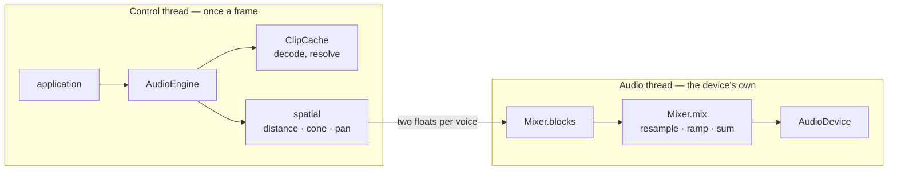

# Architecture

## The division that shapes everything

There are two threads, and every design decision here follows from which side of
them a job belongs on.

The **control thread** resolves a name to a file, decodes it, works out where a
sound is relative to the listener, and turns that into a pair of per-ear gains.
All of it in `AudioEngine`.

The **audio thread** multiplies samples by gains and adds them up. All of it in
`Mixer`, which never sees a path, a matrix or a listener.

**The only thing crossing between them is two floats per playing sound.** A
moving emitter is not restarted, re-resolved or re-decoded: its voice's target
gains are overwritten, and the mixer ramps to them across the next block. That
is why a scene can update every sound it has, every frame, without the audio
thread noticing.

## Modules

| Module | Job | Depends on |
|---|---|---|
| `_backend` | Is `miniaudio` installed? Asked once, answered in one place | — |
| `model` | `KHR_audio_emitter` as typed records | `spatial` |
| `spatial` | Gain curves and the listener's pose | numpy |
| `clip` | Encoded audio → mono float32, decoded once | `_backend` |
| `library` | What a document's audio references resolved to | `model`, `clip` |
| `synth` | Clips made out of arithmetic | `clip` |
| `mixer` | The voice pool and the block mixing | `clip`, `spatial` |
| `device` | Where blocks go, and what to do when nowhere | `_backend` |
| `engine` | The one object an application holds | all of the above |

Nothing in the list knows what a scenegraph is. A consumer hands the engine
world positions and a listener pose; where those came from is its own business.
`Listener.from_view_platform()` accepts anything satisfying the `ViewPlatform`
protocol — a `position` and a `quaternion` — which is the entire extent of the
coupling, and stating it as a `Protocol` means a type checker verifies it rather
than a reader trusting a paragraph.

`_backend` exists because two modules need the same fact and would otherwise
each keep their own copy of it: `clip` asks whether a file can be decoded and
`device` asks whether a sound card can be reached, and both are the question
"is `miniaudio` installed?". Two answers to one question drift.

## Rules that are not negotiable

- **The audio thread never allocates, blocks, decodes, resolves a path or
  logs.** An allocation on the audio thread is a garbage collection on the audio
  thread, and that is an audible gap. See [MIXING.md](MIXING.md) for how that is
  enforced and tested.
- **Clips are mono.** A stereo source has already decided where it sits in the
  stereo field, and a sound that has decided cannot then be panned to where it
  actually is in the world. Stereo files are mixed down as they decode.
- **Silence is a backend, not an error.** `miniaudio` may be absent, a device may
  refuse to open, and a machine may have no audio hardware at all. All three end
  in one warning and a `NullDevice`; `open_device()` cannot raise. A machine with
  no sound is a normal machine, continuous integration is one, and audio must
  never be why an application will not start.
- **The published schema *is* the in-memory model.** No private format sits
  between a glTF document and the mixer. See [DATA-MODEL.md](DATA-MODEL.md).
- **A document is not trusted, and its `uri` is never resolved here.** Turning a
  reference into bytes is the application's decision, because only the
  application knows where its content lives and what it may reach. That is what
  `library` is for; see [SECURITY.md](../SECURITY.md).
- **Numbers are checked where they cross onto the audio thread**, and nowhere
  else. A NaN gain survives `np.clip`, and every voice accumulates into one
  buffer, so one degenerate transform would silence the whole scene. See
  [MIXING.md](MIXING.md#gains-are-checked-at-the-boundary).
- **An application calls all of this from one thread** — the one that draws the
  frame. The engine, the clip cache and every library are control-thread state
  with no locks on them. See
  [GAME-INTEGRATION.md](GAME-INTEGRATION.md#the-one-rule-that-is-not-about-audio).

## Two volumes, and they multiply

`AudioEngine` carries two independent levels, and conflating them is the one
mistake here that produces a volume control which prints a new number and
changes nothing.

| | Who owns it | Written by |
|---|---|---|
| `engine.volume` | the **player** | a settings screen, a volume key — safe to re-read every frame |
| `engine.master_gain` | the **application** | the application, once: how loud this content is authored to be |

The mixer sees their product, and `AudioEngine._apply_gain()` is its only
writer. Writing one over the other every frame would make whichever loses last
exactly one frame.

## Dependencies

NumPy, and nothing else. `miniaudio` is an optional extra
(`pip install omi_audio[playback]`) for decoding files and reaching a sound
card; it is optional because it publishes no `manylinux_aarch64` wheel, so an
ARM container would otherwise need a compiler. It and every decoder it bundles
are MIT or public domain, which is why it is the only audio dependency this
project takes — the convenient alternatives (`libsndfile`, PyAV,
`pydub`-via-ffmpeg) are LGPL or worse.
