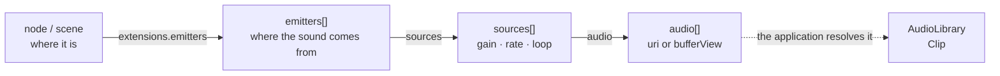

# The data model

`omi_audio.model` is glTF's
[`KHR_audio_emitter`](https://github.com/omigroup/gltf-extensions/tree/main/extensions/2.0/KHR_audio_emitter)
extension as plain dataclasses, field for field, with the extension's own
defaults and its own spelling — `refDistance`, not `reference_distance`.

Choosing a published schema rather than inventing one buys three things: a scene
authored in Blender, Godot or Three.js arrives with its sound intact; glTF
import and export are a near-identity mapping; and there is no private format to
keep in sync with the specification. It is the same decision `omi_physics` makes
with the OMI physics extensions.

## Three arrays, referenced by index



The indirection is what lets one file's sounds be shared: several emitters may
name one source, and several sources may name one piece of audio data.

| Record | Holds |
|---|---|
| `Audio` | Where the encoded bytes are — a `uri` beside the document, or a `bufferView` inside it, with a `mimeType` |
| `AudioSource` | One piece of audio *plus how to play it*: `gain`, `playbackRate`, `loop`, `autoplay` |
| `AudioEmitter` | `global` (music, ambience, narration — the listener's position is irrelevant) or `positional` (a place in the world) |
| `PositionalProperties` | The distance curve and the cone: `distanceModel`, `refDistance`, `maxDistance`, `rolloffFactor`, `shapeType`, `coneInnerAngle`, `coneOuterAngle`, `coneOuterGain` |

A `positional` emitter always has `PositionalProperties`, defaulted if the
document left them out, so nothing downstream tests for their absence. A
`global` emitter has none, because the extension forbids them; one that arrives
with them anyway has them dropped, and the fact is logged.

## Where an emitter *is*

The three arrays say nothing about position. That link is on the scene graph,
and reading it is what turns a "positional" emitter into a sound with a place:

```json
"nodes":  [{ "extensions": { "KHR_audio_emitter": { "emitters": [0] } } }],
"scenes": [{ "extensions": { "KHR_audio_emitter": { "emitters": [1, 3] } } }]
```

```python
for emitter in document.emitters_for_node(node):
    engine.play_source(source, library, emitter=emitter,
                       position=world_position_of(node),
                       forward=world_forward_of(node))
```

- `emitters_for_node(node)` — both kinds may appear on a node. The node's world
  transform is the emitter's position and its facing.
- `emitters_for_scene(scene)` — a scene has no transform, so the extension
  permits only `global` emitters here. A positional one is dropped with a
  warning: a malformed scene should lose a sound, not fail to load.
- `emitter_indices(container)` / `emitter_reference(indices)` — the raw read and
  write, for a loader or an exporter that wants the numbers rather than the
  records.

Any index that points at nothing is skipped rather than raising.

## Reading and writing

```python
from omi_audio import model

document = model.from_gltf(gltf['extensions'][model.EXTENSION])
block = model.to_gltf(document)          # back out again
```

`from_gltf` **never raises**, whatever the document contains. Third-party content
is not always well formed, and a scene that loads with one silent emitter is
worth more than a traceback. Three things follow from that:

- **Keys the model does not declare are dropped.** A document may use extensions
  this library has never heard of, and refusing it would trade a missing feature
  for a missing scene.
- **Values of the wrong type are dropped too**, back to the field's default, with
  one log line naming the field. This matters more than it sounds: a string
  `gain` that *loads* detonates later, inside the mixer, on another thread, a
  long way from the document that caused it.
- **Entries that are not objects are skipped**, and an array that is not an array
  is ignored.

`to_gltf` **writes only non-default fields**, and only non-empty arrays, so a
round-tripped document is no larger than the one that was read. It copies
container values, so renumbering indices in an exported block — the ordinary
reason to touch one — cannot rewrite the document it came from.

`AudioDocument.sources_for()` and `audio_for()` resolve indices, skipping any
that point at nothing.

## Getting the actual audio: `AudioLibrary`

**A `uri` is never resolved by this library.** It is a string out of a file from
a third party, and resolving one means agreeing to interpret
`../../../../etc/passwd`, `file:///`, `\\host\share\x.wav` and
`http://somewhere/x.mp3` on the application's behalf, under a policy the
application never got to see. The application knows where its content lives, has
a resolver and a download cache already, and is the only party that can say what
a document may reach.

So `omi_audio.model` holds the reference and
[`omi_audio.library.AudioLibrary`](../src/omi_audio/library.py) is where the
application hands back what it resolved:

```python
def fetch(library, index, audio):
    if audio.bufferView is not None:                 # a .glb embeds its audio
        library.supply_bytes(index, gltf.buffer_view_bytes(audio.bufferView))
    elif (path := resolver.resolve(audio.uri)):      # your policy, your resolver
        library.supply_file(index, path)
    else:
        library.fail(index, 'outside the content directory')

library = engine.library(document, fetch=fetch)
engine.play_source(document.sources[0], library)
```

`fetch` is called at most once per index, on the first ask. It may supply before
it returns (everything is local) or start a download and supply later — until it
does, `library.clip(index)` is None, which is the ordinary "no sound this frame"
answer the whole engine already tolerates. `library.pending` says what is still
in flight, for an application with a loading screen.

This is also how `bufferView` audio and `data:` URIs play: both are bytes the
consumer's loader already holds, and both go through `supply_bytes`.

## Autoplay

`AudioSource.autoplay` means "start this when the glTF is loaded", and **nothing
in this library starts by itself**. Loading a document must not make a noise, and
only the application knows whether "loaded" and "the scene the player is in" are
the same moment — for anything with a loading screen they are not.

```python
handles = engine.start_autoplay(library, place=world_pose_of_emitter)
```

`AudioDocument.autoplay()` returns the `(emitter, source)` pairs the document
asks for, if you would rather drive it yourself. It is pairs rather than sources
because a source is only ever heard through an emitter — and one source on two
emitters is two sounds, in two places.

## Codecs

The base extension requires only `audio/mpeg`. `OMI_audio_ogg_vorbis` and
`OMI_audio_opus` add others, and what can actually be decoded is a separate
question answered by `omi_audio.clip` — with `miniaudio` installed that is
`.wav`, `.mp3`, `.ogg` (Vorbis) and `.flac`.

The intended pattern is to offer several and take the first that decodes: give
the better format, fall back to the one everything can play.

`decode_bytes` detects the format from the bytes themselves, so a `mimeType`
that disagrees with the payload does not matter.

## What is not in the extension

Three things a consumer wants that `KHR_audio_emitter` has nowhere to say. They
are not in `model` — they belong to whatever drives it — but they are worth
knowing about when designing on top of this. See
[GAME-INTEGRATION.md](GAME-INTEGRATION.md#what-the-application-has-to-do-itself).

- **priority**, which sound survives when there are more sounds than voices.
  `Mixer.play()` takes it; VRML97's `Sound.priority` names it the same way.
- **a repeat interval**, for ambience that is *occasional* rather than
  continuous. Looping a distant rumble gives a continuous noise where a sparse
  one was wanted.
- **variance on that interval**, so two speakers of the same sound drift apart
  instead of beating together for ever.
