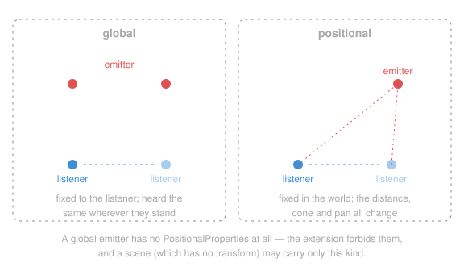
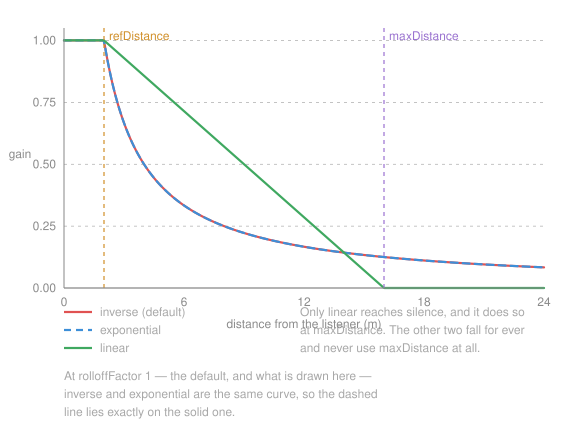
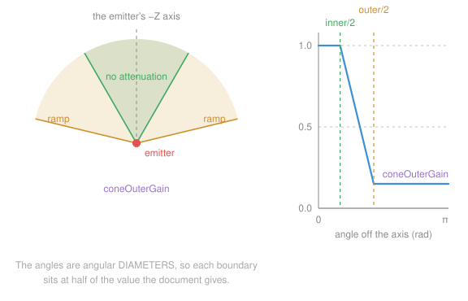
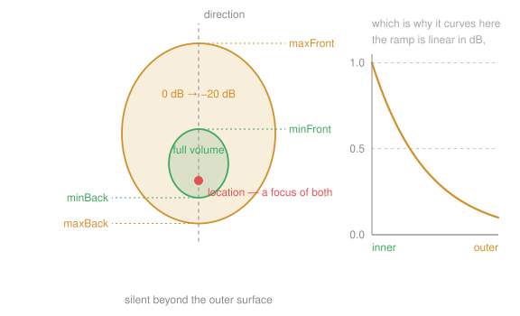
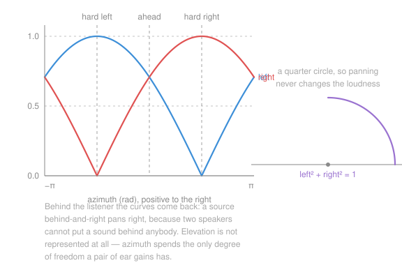

# Spatialisation

A sound's loudness at the listener is a **product of independent factors**, each
a small pure function of geometry returning a linear multiplier in `[0, 1]`.
Splitting them this way is what makes each testable in isolation and replaceable
without touching the others.

```text
level = source.gain
      × emitter.gain
      × distance_gain(distance, model, refDistance, maxDistance, rolloffFactor)
      × cone_gain(angle, coneInnerAngle, coneOuterAngle, coneOuterGain)

left, right = equal_power_pan(azimuth)
voice.set_gain(level * left, level * right)
```

Everything below is in `omi_audio.spatial`.

> Every diagram on this page is **generated from `spatial.py`** by
> [`make_diagrams.py`](make_diagrams.py), and `tests/test_diagrams.py` fails if
> a committed picture stops matching what the code produces. A drawing of a gain
> curve is a claim about the code, and this is how the claim stays true.

## Emitters: global and positional



A **global** emitter is fixed to the listener: music, ambience, narration. It has
no `PositionalProperties` at all — the extension forbids them — and it is the only
kind a *scene* may carry, because a scene has no transform. A **positional**
emitter is somewhere in the world, and everything on the rest of this page
applies to it.

A positional emitter is placed by the **node** that references it, and reading
that reference is what gives the emitter a position at all; see
[DATA-MODEL.md](DATA-MODEL.md#where-an-emitter-is).

## Distance



Three curves, from `KHR_audio_emitter`, which takes them from the Web Audio
API's `PannerNode`. `refDistance` is where each curve reads 1.0 and inside which
nothing is attenuated; `rolloffFactor` is how sharply it falls.

| Model | Curve | Reaches silence? |
|---|---|---|
| `inverse` (default) | `ref / (ref + rolloff × (max(d, ref) − ref))` | no, asymptotically |
| `exponential` | `(max(d, ref) / ref) ** −rolloff` | no, asymptotically |
| `linear` | `1 − rolloff × (clamp(d, ref, max) − ref) / (max − ref)` | yes, at `maxDistance` |

`linear` is the only one that ever reaches zero, so a `linear` emitter needs a
`maxDistance` greater than its `refDistance` to mean anything at all. Given one
that is not, it is audible within `refDistance` and silent past it.

**`inverse` and `exponential` are the same curve at the default
`rolloffFactor`.** Put 1 into each formula and one becomes `ref / d` and the
other `(d / ref)⁻¹`, which is the same number at every distance — which is why
the exponential curve is drawn dashed above, lying exactly on the inverse one.
`rolloffFactor` is what separates them: below 1 the exponential model stays
louder further out, above 1 it falls away faster. If you are choosing between
the two models and hearing no difference, that is why.

`refDistance` must be positive — every model divides by it — and a non-positive
one raises `ValueError` rather than producing a silent nonsense curve.

### `maxDistance` means two different things, and this library picks one

Read the formulas above and `maxDistance` appears in exactly one of them. Read
the extension's *prose* and it is "the maximum distance between the emitter and
listener, **beyond which the audio cannot be heard**" — which none of the three
formulas implements.

`distance_gain` implements **the formulas**, because they are what Web Audio's
`PannerNode` does and therefore what content authored in Blender, Godot or
three.js is tuned against. Matching the formulas is what makes a scene sound the
same here as where it was made.

That leaves the prose reading available where an application wants it, as a
separate and explicit test:

```python
if emitter.positional.in_range(distance):
    engine.play(...)
```

`PositionalProperties.in_range()` is `maxDistance` as a hard cutoff. It is also
the cull an application wants anyway — an inaudible emitter still costs a voice —
so the recommendation is to use it, rather than to expect the gain curve to.

*(The conflict is in the extension, not in the reading of it. It is worth
raising upstream with the OMI group; until it is resolved, the split above is
the interoperable choice.)*

## Cone



`cone_gain(angle, inner, outer, outer_gain)` attenuates by *direction*: how far
off its own forward axis an emitter has to look to see the listener.

The two angles are **angular diameters** — the whole cone from side to side — so
the boundaries are at half of each. Inside the inner cone there is no
attenuation; outside the outer cone the gain is `coneOuterGain`; between them it
interpolates linearly.

Both default to a full turn, which describes a sphere, which is why an emitter
that never sets them is never attenuated by direction. The cone applies only
when `shapeType` is `cone`.

An emitter faces its own **−Z**, as glTF cameras and `KHR_lights_punctual` do,
so a node's world transform gives both its position and its axis.

## The VRML97 ellipsoids



A VRML97 `Sound` node attenuates differently and nothing else can express it, so
it is implemented rather than approximated: two ellipsoids **sharing a focus at
the sound**, reaching `minFront`/`maxFront` along the sound's direction and
`minBack`/`maxBack` against it.

Measuring from the focus rather than the centre makes the surface a focal conic,
whose polar form collapses to

```text
reach(θ) = 2 · front · back / ((front + back) − (front − back) · cos θ)
```

— the harmonic mean of the two distances at right angles, and each distance
itself along the axis.

Full volume inside the inner ellipsoid, silence outside the outer, and between
them a ramp that is **linear in decibels** from 0 dB to −20 dB. Linear in
decibels rather than in amplitude is what makes the sound fade the way a
listener expects instead of vanishing at the end of the ramp — and it is why the
ramp in the diagram is a curve rather than a straight line. The specification
calls −20 dB inaudible, so the gain is forced to zero past the outer surface;
the resulting step is smoothed by the mixer's per-block gain ramp rather than
being fudged here, which keeps this function the specification's own curve.

Most callers want `ellipsoid_gain_at(location, direction, listener_position, …)`,
which works the distance and the angle out from three world-space vectors.
[VRML97.md](VRML97.md) maps every field of a `Sound` node onto this API.

## Panning



`equal_power_pan(azimuth)` gives the two ear gains for a mono source `azimuth`
radians off centre, positive to the right. They trace a quarter circle, so
`left² + right²` is 1 at every angle: panning moves a sound across the stereo
field without changing how loud it is.

A source **behind** the listener is folded onto its mirror image in front —
behind-and-right pans right. Two loudspeakers cannot put a sound behind
anybody, and the fold is what the Web Audio API specifies rather than something
chosen here.

### What the output does not do

**The output is stereo, and elevation is not represented.** A pair of ear gains
has one degree of freedom and the azimuth spends it, so a sound directly
overhead and one dead ahead are indistinguishable. `azimuth_elevation()` returns
the elevation, and an application is free to use it — to duck a sound that is
above the listener, or to drive a filter of its own — but nothing in this library
consumes it.

Stereo headphones are what `omi_audio` aims at. Height needs an HRTF and
surround needs more than two channels; neither is implemented, and both would be
a new renderer rather than a change to `equal_power_pan`.

## The listener

`Listener` is a frozen record of `position`, `forward` and `up`; the axes are
normalised on construction, so a caller may pass whatever length falls out of
its own maths. `azimuth_elevation()` puts a world point in the listener's own
frame; `right` is the cross of forward and up.

`Listener.from_view_platform(platform)` builds one from anything with a
`position` and a `quaternion` — stated as the `ViewPlatform` protocol, so a type
checker can verify the duck-typing rather than a reader having to trust it. The
camera *is* the listener: a scene with sound in it wants the two to agree, and
reading the pose from the camera every frame leaves nothing for an application
to keep in step.

A point *at* the listener has no bearing at all, and is reported as dead ahead —
a sound placed on the camera pans to the centre rather than dividing by zero.

A **non-finite** pose — a degenerate transform, an uninitialised bone — produces
non-finite gains here, honestly, because a caller doing its own mixing is better
served by the arithmetic than by a guess. They are turned into silence where
they cross onto the audio thread; see [MIXING.md](MIXING.md#gains-are-checked-at-the-boundary).

## References

- `KHR_audio_emitter` —
  <https://github.com/omigroup/gltf-extensions/tree/main/extensions/2.0/KHR_audio_emitter>
- Web Audio API, "Spatialization" —
  <https://webaudio.github.io/web-audio-api/#Spatialization>
- ISO/IEC 14772-1:1997 (VRML97) 6.42 `Sound` —
  <https://www.web3d.org/documents/specifications/14772/V2.0/part1/nodesRef.html#Sound>
